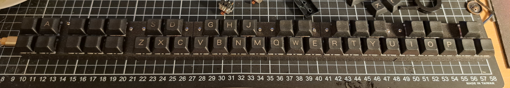
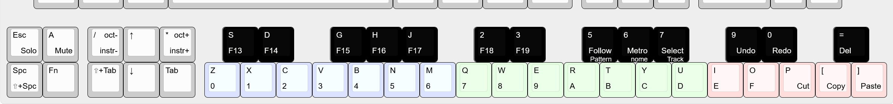

# Cricket: a keyboard for music trackers

*This is a Work In Progress project. 3D models, firmware code and documentation are incomplete.*

The **Cricket** is a 3D printable DIY special purpose keyboard for tracker style Digital Audio Workstation software, chiefly for use with [Renoise](https://www.renoise.com/). Once built, it is completly Plug-and-Play, no drivers or computer setup. The computer detects it as a regular computer USB keyboard and in fact the **Cricket**'s note keys will type letters and numbers in any software (e.g. Notepad) other than music trackers. **Cricket**'s firmware doesn't offer MIDI functionality yet, and the keys have no velocity sensitivity. By being only 2u tall (~40mm) it is shorter than the vast majority of MIDI keyboards.

Other music tracker software also commonly use alphanumeric keys for note input, thus **Cricket** probably works with them as well. Control keys (toggling edit mode, play-pause, note-off, etc.) are only set up for Renoise, but feel free to adjust the key assignmets and firmware to your liking, adapt it to your favorite tracker.

The **Cricket** uses a raspberry pi pico microcontroller and its firmware is implemented with KMK (CircuitPython). The top plate is designed to accept Cherry MX style keyswitches.

## Layout

The **Cricket** is designed to fit under a regular full sized keyboard while the regular keyboard still remains somewhat useable. The primary goal was to make the note input more pleasant. Holding down the **Fn** key unlocks a second layer with additional commands. Most command keys as set for commands that have default shortcuts, but there are additional F13-F19 keys on the second layer which can be used for setting up custom shortcuts.

Top labels mark the first layer keys, bottom labels mark the second layer. Left aligned labels are the actual keycode sent, right aligned are the semantic meaning.

You can open the layout in the online [keyboard-layout-editor](http://www.keyboard-layout-editor.com/) by drag-and-dropping [Cricket's layout json](docs/cricket_layout.json) into the page.

## Wiring

The **Cricket** has 2 rows and 24 columns which are wired as 8 rows and 6 columns to reduce the number of wires that need to fit inside and to require less pins on the microcontroller (26 vs 14).

## Build

TODO
